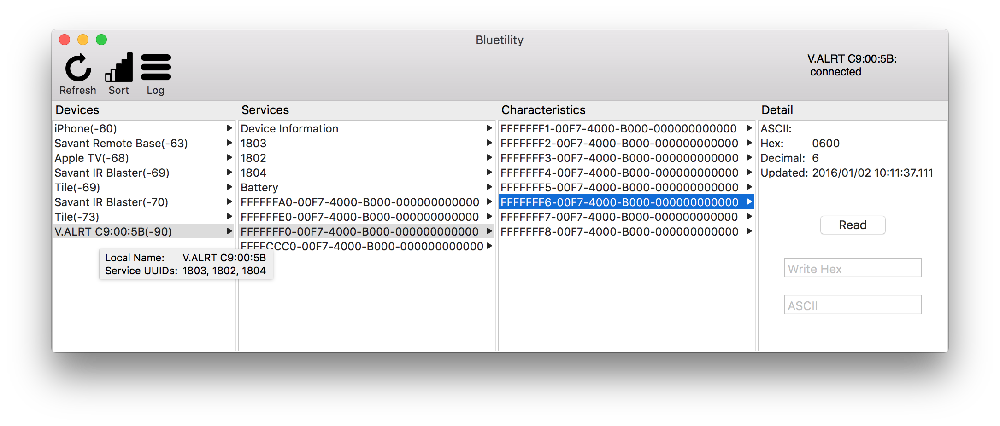

# Bluetility

Bluetility is a general-purpose Bluetooth Low-Energy utility for Mac OS X.  It scans for advertising peripherals, provides a interface to browse a connected peripheral's services and characteristics, and allows characteristic values to be read, written, and subscribed.


## Installation

### Manual
1. Download the latest release:  https://github.com/jnross/Bluetility/releases/latest/download/Bluetility.app.zip
2. Extract the downloaded archive.
3. Move Bluetility.app into your /Applications folder.  Or don't!
4. Open Bluetility.app.

### Using Homebrew
```
brew install --cask bluetility
```

## Features

* Scan for nearby advertising peripherals
* Sort peripherals by received signal strength
* View advertising data via tooltip on Devices list
* Browse services and characteristics of connected peripheral
* Subscribe to characteristic notifications
* Read/Write characteristic values
* View log of characteristic read/writes, logs may be saved as CSV

## Motivation
Bluetility is inspired by [LightBlue](https://itunes.apple.com/us/app/lightblue/id639944780?mt=12), a free bluetooth utility published by [Punch Through Design](https://punchthrough.com/).  Bluetility was created to resolve issues in this tool, and add missing features:

* Support copy/paste via Cmd+C and Cmd+V
* Sort peripherals by received signal strength
* View advertising data
* Automatically reconnect to disconnected peripherals when needed

Bluetility is published as open-source so that anyone can tweak or improve its functionality to meet their own needs.
